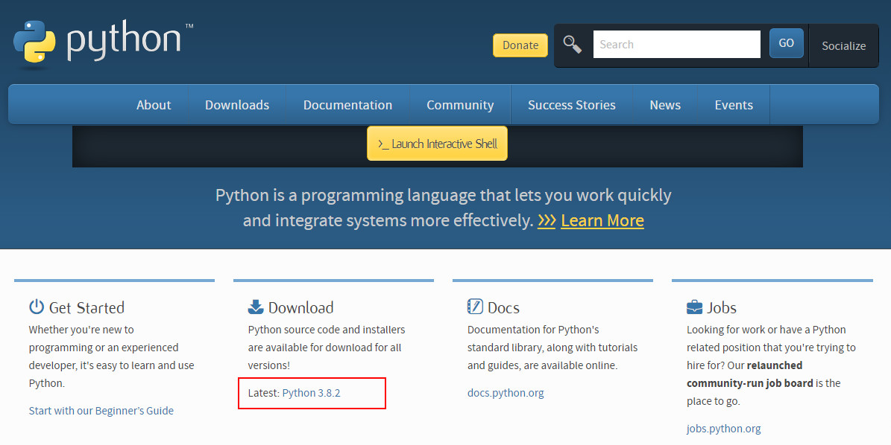
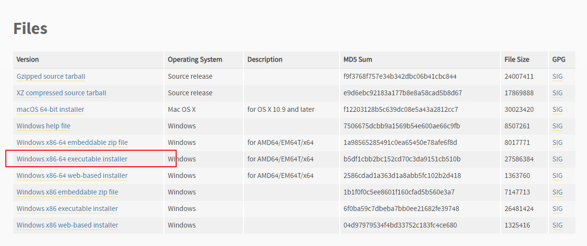
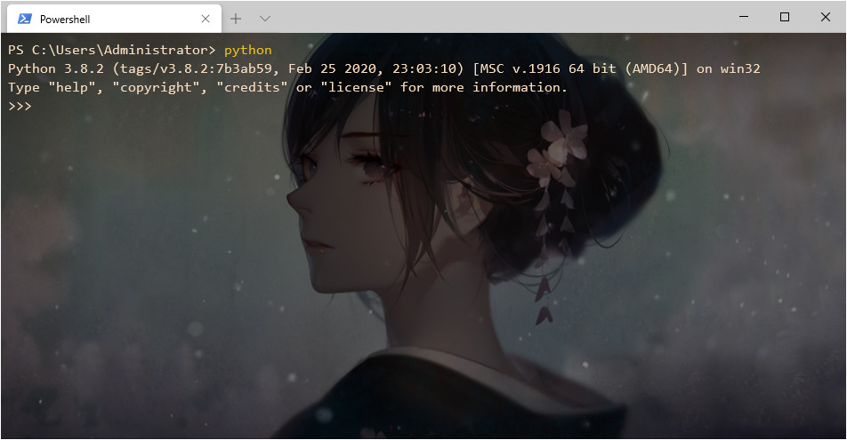
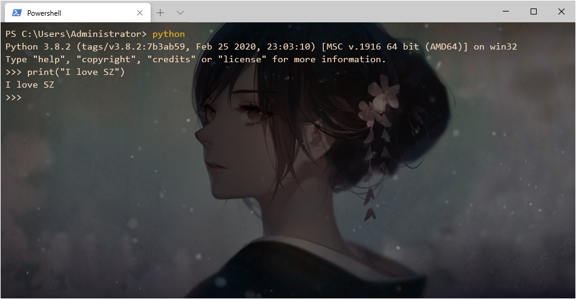
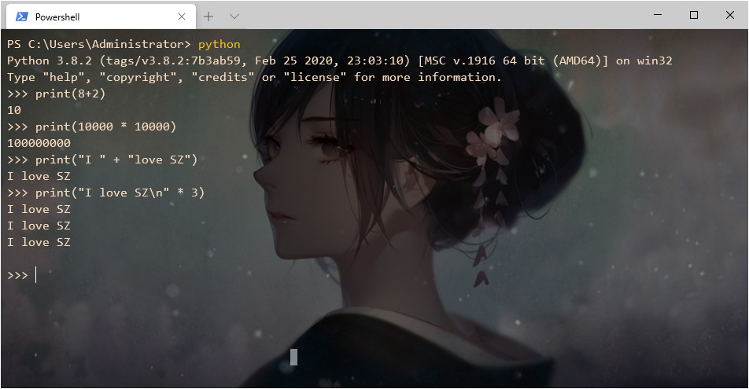
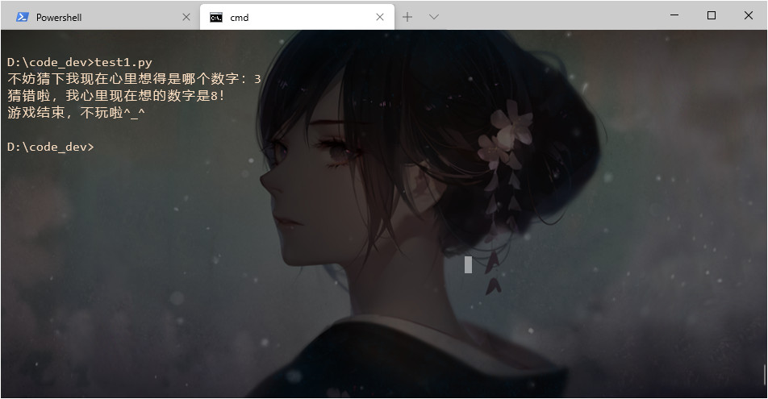
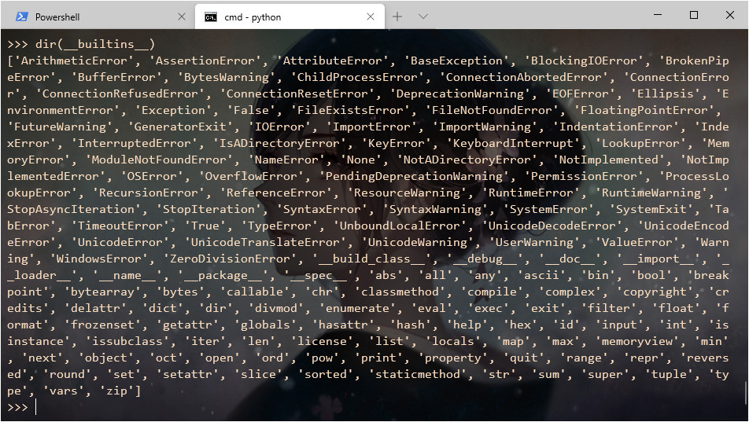
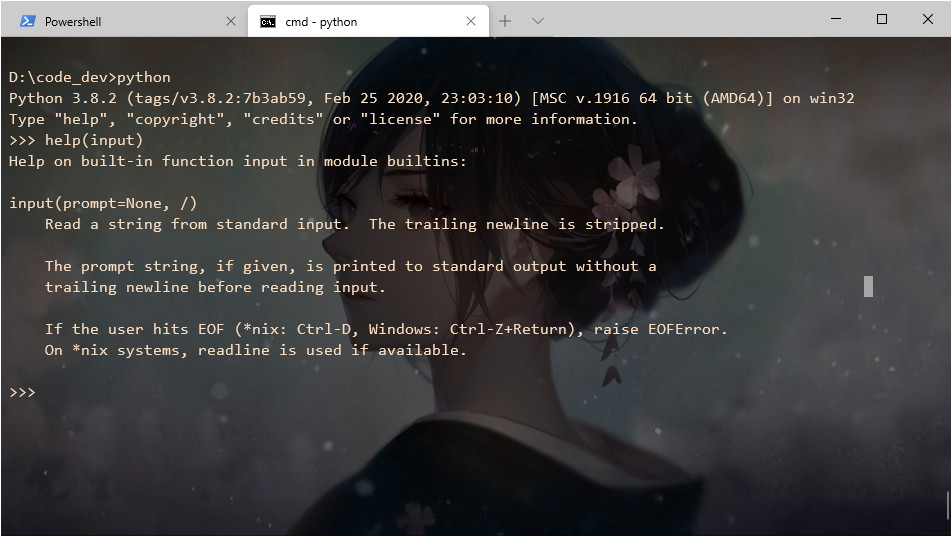

### 第一章：愉快的开始

开始之前，熟悉一下常用的cmd命令

#### 1.0、 常用的cmd命令

+ `dir` 查看当前文件夹下的文件及文件夹
  + `d-----`表示文件夹
  + `-a----`表示文件
+ `cd` 切换目录/文件
+ `cd file` 进入当前文件夹下的file文件夹
+ `cd fold1/fold2` 或者 `cd fold1\fold2`进入多层文件夹
+ `cd ..` 进入上一层文件夹
+ `cd ../folder` 进入上一层文件夹中的folder文件夹
+ `mkdir myfolder` 或 `md myfolder` 在当前目录下创建myfolder文件夹
+ `type nul > my.txt` 创建空白的my.txt文件
+ `echo content > my.txt` 创建内容是content的my.txt文件
+ `type test1.py` 查看在当前目录下的额test1.py文件内容，把内容打印到cmd中
+ `test1.py` 直接输入文件名，用默认程序打开此文件（相当于鼠标双击）
+ `ren oldname newname` 重命名
+ `del test1.py` 删除文件
+ `del myfolder` 删除myfolder文件夹中所有文件（文件夹保留）
+ `rd myfolder` 或者 `rmdir myfolder` 删除myfolder文件夹
+ `tree myfolder` 将myfolder文件夹下的所有文件夹展示成树状结构（不展示文件）
+ `tree myfolder /f` 展示文件夹及文件树状结构
+ `tree myfolder /f > my.txt` 将结果输出到my.txt文件中（新建的文件）
+ cls 清屏

#### 1.1、Python的安装

安装Python非常容易，在官网（[https://www.python.org/](https://www.python.org/)）找到Download字样，点击Latest:Phton 3.x.x 下载 Window x86-64 exeecutable installer 安装包并选择默认安装即可。





#### 1.2、shell使用Python

打开cmd/power shell命令窗口，键入`python` 便会进入Python以`>>>`开始的工作环境。

`>>>`提示符的含义是： Python已经准备好了，等你输入指令了！

然后键入

```python
print("I love SZ")
```

即可打印数据。需要注意的是，Python3.x 版本并不支持2.x版本的语法！

```python
print("I love SZ") # Python 3.x的语法
print "I love SZ" # Python 2.x的语法 不兼容
```






#### 1.3、Python的其他尝试

Python可以做数字的加减乘除，字符串的连接，重复等普通语言都可以做的操作，不足为奇。




### 第二章：用Python设计一个小游戏

#### 2.1、第一个小游戏

```python
# test1.py
temp = input("不妨猜下我现在心里想得是哪个数字：")
guess = int(temp)
if guess == 8:
    print("你是我心里的蛔虫吗？！")
    print("哼，即使你猜对了也没有奖励！")
else:
    print("猜错啦，我心里现在想的数字是8！")
print('游戏结束，不玩啦^_^')
```

cmd中切换到test1.py所在的目录，然后键入`test1.py`运行此python文件，即可开始游戏。

从上面可以看到python声明变量是不需要任何事先声明的。



#### 2.2、缩进

python中采用缩进取代大括号，缩进与冒号（:）快速构成和判断python的语法。

#### 2.3、BIF

BIF(Built-in Functions),内置函数的意思。内置函数就是此语言自带的一些函数，只需要直接调用即可实现。例如：

+ `print()`就是一个内置函数，功能就是‘打印到屏幕’。
+ `input()` 也是一个BIF，作用是接受用户输入并将其返回
+ `dir(__builtins__)` 可以看到Python所有的BIF
+ `help()` 这个BIF用于显示BIF的功能描述





#### 2.4、Test-001

> 编写程序：hello.py , 要求用户输入姓名并打印“你好，姓名！”

```python
# hello.py
temp = input('请输入您的姓名：')
if temp != "":
    print("你好，" + temp + "!")
else:
    print("姓名不能为空哦！")
```

```bash
D:\code_dev>hello.py
请输入您的姓名：
姓名不能为空哦！

D:\code_dev>hello.py
请输入您的姓名：devin
你好，devin!
```

#### 2.5、 Test-002

> 编写程序：calc.py，要求用于输入1到100之间数字并判断，输入符号要求打印“你妹好漂亮”，不符合要求则打印“你大爷好丑”

```python
# calc.py
temp = input("请输入1到100之间的数字：")
if 1 <= int(temp) <= 100:
    print("你妹好漂亮")
else:
    print("你大爷好丑")
```

```bash
D:\code_dev>calc.py
请输入1到100之间的数字：0
你大爷好丑

D:\code_dev>calc.py
请输入1到100之间的数字：18
你妹好漂亮

D:\code_dev>calc.py
请输入1到100之间的数字：101
你大爷好丑
```

